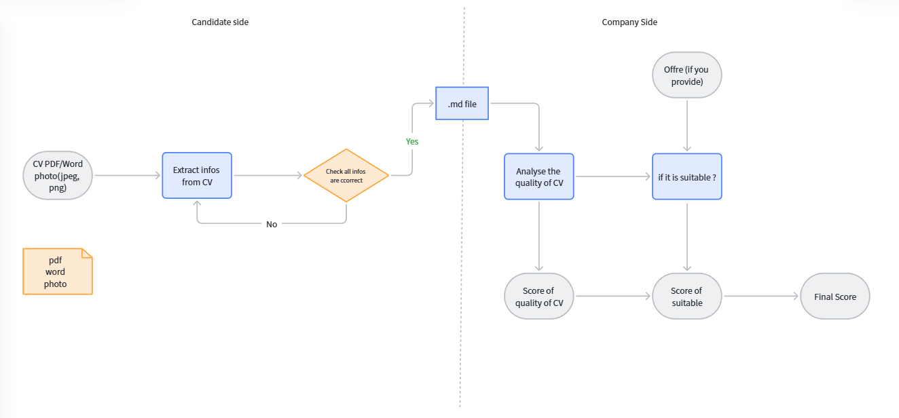

# CV Scorer

CV Scorer extracts resume PDFs into Markdown and produces an explainable rule-based resume score.



## What It Does

- Renders PDF pages into images.
- Sends page images to a local OCR model service.
- Merges page-level OCR output into Markdown.
- Parses resume Markdown into structured fields.
- Scores resumes with transparent section-level feedback.

## Architecture

```text
PDF -> PNG -> OCR -> Markdown -> Resume Profile -> Score Report
```

Key modules:

- `src/cv_scorer/pdf_to_png.py`: PDF page rendering.
- `src/cv_scorer/png_to_markdown.py`: OCR service client.
- `src/cv_scorer/pdf_to_markdown.py`: PDF-to-Markdown orchestration.
- `src/cv_scorer/markdown_to_resume.py`: Markdown-to-profile parser.
- `src/cv_scorer/scoring.py`: rule-based scoring engine.
- `src/cv_scorer/backend_api.py`: FastAPI backend.
- `docker/ocr-server/app.py`: local OCR model service.

## Setup

Create a virtual environment and install dependencies:

```powershell
python -m venv .venv
.\.venv\Scripts\python.exe -m pip install -r requirements-dev.txt
```

Optional OCR model configuration is documented in `.env.example`.

## Start OCR Service

The OCR service runs locally with Docker and uses `lightonai/LightOnOCR-2-1B`.

```powershell
docker compose -f .\compose.ocr.local.yml build
docker compose -f .\compose.ocr.local.yml up -d
```

Check the service:

```powershell
Invoke-WebRequest -UseBasicParsing http://127.0.0.1:8000/healthz
```

## Run

Extract a PDF to Markdown:

```powershell
.\.venv\Scripts\python.exe .\extract_pdf_to_markdown.py .\resume.pdf -o .\resume.md
```

Start the backend API:

```powershell
.\.venv\Scripts\python.exe .\run_backend_api.py
```

Score Markdown:

```powershell
curl -X POST http://127.0.0.1:9000/v1/score/markdown `
  -F "markdown=# Jane Doe"
```

## API

Main backend endpoints:

- `GET /healthz`
- `POST /v1/render/pdf-to-png`
- `POST /v1/extract/png-to-markdown`
- `POST /v1/extract/pdf-to-markdown`
- `POST /v1/extract/pdf-to-markdown-file`
- `POST /v1/score/markdown`

See [docs/api_spec.md](docs/api_spec.md) for details.

## Tests

Run lightweight tests:

```powershell
.\.venv\Scripts\python.exe -m pytest -q
```

OCR integration tests are opt-in:

```powershell
$env:RUN_OCR_TESTS="1"
.\.venv\Scripts\python.exe -m pytest -m integration -q
```

## Docs

- [Project guide](docs/project_guide_en.md)
- [API spec](docs/api_spec.md)
